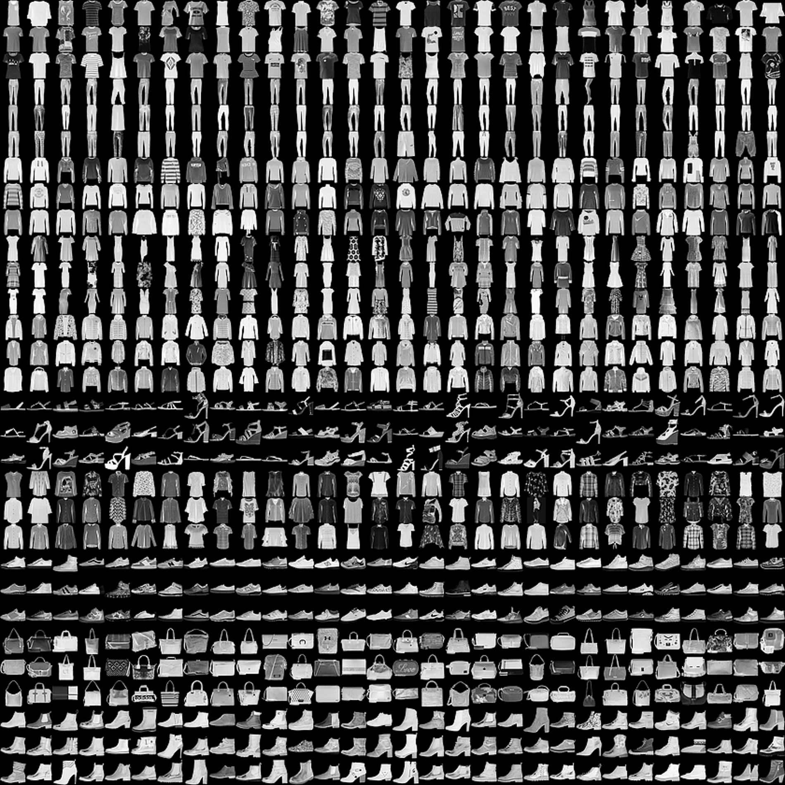

# Software requirements
Python 3.6, TensorFlow 1.11.0, Keras 2.2.4, numpy, matplotlib, scikit-learn, h5py

# Fashion-NIST
Fashion-MNIST là bộ dữ liệu hình ảnh của Zalando, bao gồm một tập huấn gồm 60.000 ví dụ và một bộ thử nghiệm gồm 10.000 ví dụ. Mỗi ví dụ là một hình ảnh thang độ xám 28x28, được liên kết với một nhãn từ 10 lớp. Zalando dự định Fashion-MNIST sẽ đóng vai trò thay thế trực tiếp cho bộ dữ liệu MNIST ban đầu cho các thuật toán học máy chuẩn. Nó chia sẻ cùng kích thước hình ảnh và cấu trúc của các phần tách đào tạo và kiểm tra.

Dưới đây là hình ảnh dữ liệu:

Link: [Fashion-NIST](https://www.kaggle.com/zalando-research/fashionmnist)

## Labels
Mỗi một mẫu ảnh sẽ được gán tượng ứng với một trong các nhãn sau:

| Label | Description |
| --- | --- |
| 0 | T-shirt/top |
| 1 | Trouser |
| 2 | Pullover |
| 3 | Dress |
| 4 | Coat |
| 5 | Sandal |
| 6 | Shirt |
| 7 | Sneaker |
| 8 | Bag |
| 9 | Ankle boot |

## Load data
Data được tổ chức trong file .csv như sau:
Mỗi dòng là một hình ảnh riên biệt gồm 785 cột, trong đó cột đầu tiên chứa label của ảnh. 784 cột còn lại chứa các giá trị pixel [0,255]

Dữ liệu được chia thành 3 tập: Train, Validation, Test:

•	num train data:  48000

•	num val data:  12000

•	num test data:  10000

# Model

[Model 1](model_image/model_1.png)

[Model 2](model_image/model_2.png)

[Model 3](model_image/model_3.png)

[Model 4](model_image/model_4.png)

# Run Program

Tải về 2 file: **fashion-mnist_train.csv** và **fashion-mnist_test.csv** theo đường link dưới

Link: [Fashion-NIST](https://www.kaggle.com/zalando-research/fashionmnist)

Thực hiện training data: Fashion_NIST_main.ipynb

Sau khi chạy xong chương trình sẽ tạo ra file: **model.h5**

Nếu không muốn training dữ liệu, bạn cũng có thể tải model đã được training sẵn theo đường dẫn sau: [pre_train model](https://drive.google.com/open?id=1wuHsxJE4QRezARDvmb8NOGLVLb-bciRk)

Run file: Fashion_Predict.ipynb

# Experiment

Accuracy

| Model | Parametter | train_acc | val_acc | test_acc |
| --- | --- | --- | --- | --- |
| model 1 | 21,386 | 0.9021 | 0.9066 | 0.9112 |
| model 2 | 544,522 | 0.9880 | 0.9312 | 0.9378 |
| model 3 | 1,224,138 | 0.9632 | 0.9356 | 0.9412 |
| model 4 | 2,272,714 | 0.9669 | 0.9366 | **0.9426** |

## Results

Model traing trên training set 60,000 samples với 48,000 training set và 12,000 valid set.
Với 64 epochs và batch_size = 128 on kerras.
Đánh giá trên 10,000k samples.

* Traning accuracy: 0.9669

* Validation accuracy: 0.9366

* Test accuracy: 0.9426

